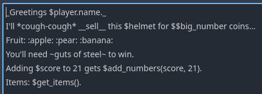
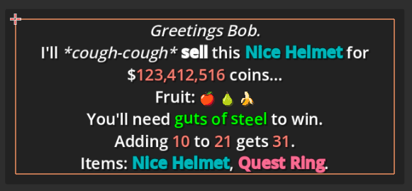
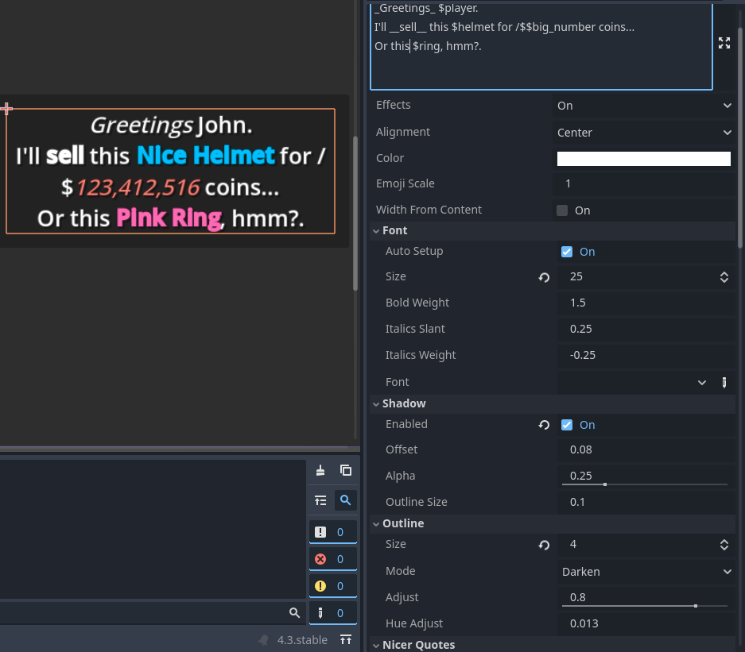
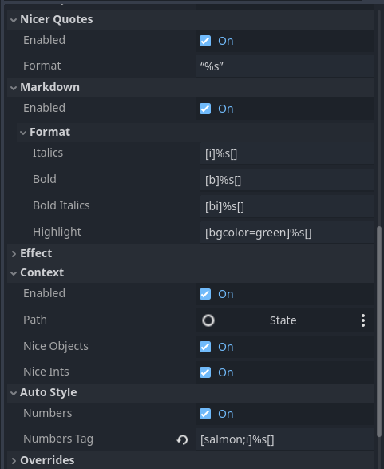

# RichTextLabel2
`v1.0`

| | |
|-|-|
|||

# Features
- Multi bbcode tags + easy closing + auto color names: `[deep_sky_blue;b]Bold blue[] and [orange;i]Italic orange[].`
- Integer tags for absolute font size, float tags are relative font_size: `[32]Big text[] and [0.5]half text.[]`
- Auto emojis: `I'm :smile: with results. You get a :+1:.`
- Effects automatically installed when you use them: `We on the [sin]sinewave[] vibe.`
	- 15 premade effects. (Some unstable/untested.)
- Context strings: `Only $coins coins, $player.name? Travel to $location.get_name("west") for more coins.`
	- Can call functions or get nested properties.
	- Niceifys integers with commas. `1234 -> 1,234`
	- Niceifys objects by calling `to_string_nice()` if it can.
	- Niceifys arrays by joining them into a comma seperated list.
- Easy font selection dropdown detects all fonts in the project.
	- Automatically creates Bold, Italic, and Bold Italic font variations if they don't exist.
	- Tweakable boldness and italic slant.
- Automatic opening and closing quotes.
- Customize how Markdown gets converted: `_italic_ -> [i]%s[] -> [i]italic[]` `*cough* -> [i]*%s*[] -> [i]*cough*[]`.
- Auto color formatting: `"My [%s]colored string[] is easy." % [Color.DEEP_SKY_BLUE]`
- `RichTextAnimation` for fading in and out.
	- 7 transition effects. (Some unstable/untested.)
	- Click2Continue node that can display at the last visible character.
	- `pause` `wait` `speed` (TODO)
- Many more I can't rememember... there are a lot of features.

> [!INFO] Pro Tip
> Emojis can really lag on loadup on some computers.
> Get around it by creating a FontVariation with the emoji font as the base and a system font as the fallback.
> See `res://demo/fonts/emoji_font.tres` for example.

Fonts will be discovered wherever they are.

Emojis will attempt to use a font named `emoji_font` if it exists in the project.

